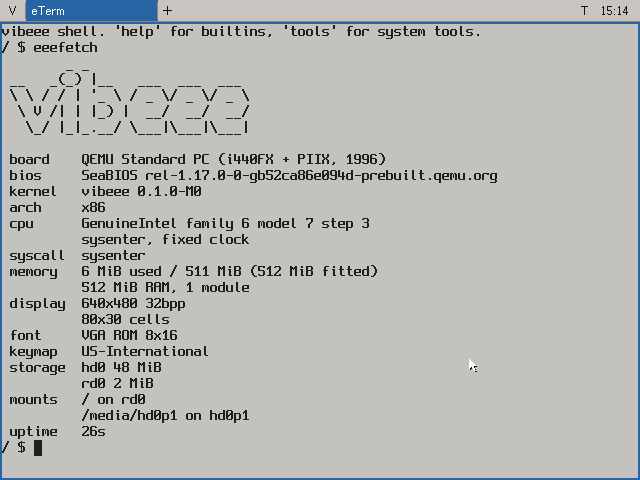

# vibeee

An experimental graphical operating system written from scratch in Zig.

**Reference machine:** ASUS Eee PC 701 4G (630 MHz Celeron M, 512 MB RAM, 800x480
display). vibeee is intended for similar low-end x86 netbooks, including later Eee PCs,
the Acer Aspire One, and the HP Mini. The 701 is the hardware-validation baseline, not
the project's only intended machine.

The QEMU development profile matches the reference machine's CPU, memory, ATA, and audio
hardware where QEMU can model them.



## Quick Start

Requirements: Zig 0.16, NASM, mtools, and QEMU.

```bash
make qemu                  # build and boot the development image
make vnc                   # boot with VNC on localhost:5901
make check-all             # format, checks, tests, images, and QEMU boot checks
```

The system starts at a shell. Run `svc start eeewm` to launch the desktop.

Useful build targets:

```bash
make image                 # build build/vibeee.img
make qemu-sd               # boot the release image as USB storage
make sd DEV=/dev/rdiskN    # guarded SD-card writer on macOS
make MANUAL=no image       # omit the on-device manual
```

Set `QEMU_AUDIODEV=none` to keep the emulated audio controller but disable host audio.

## Included System

- Bootloader, 32-bit x86 kernel, preemptive O(1) scheduler, processes, ELF loader,
  capabilities, channels, events, shared memory, and a panic QR-code report.
- FAT12/16/32 with VFAT long filenames; persistent `/cfg` and `/home` volumes.
- Native GMA 900/950 modesetting, a framebuffer display server, tiling and floating
  windows, launcher, and the `libeui` control library.
- ATA, ACPI/uACPI platform support, battery, backlight, hotkeys, USB mass storage/HID,
  AC'97 and HDA playback, and wired IPv4 networking with DHCP, DNS, TCP, and UDP.
- Shell, multicall command-line tools, and a small POSIX-lean C library for ports.

## Kernel Model

The kernel runs in Ring 0; applications, services, and most hardware drivers run in
Ring 3 with separate address spaces. Processes receive only the capability handles they
need at spawn time, and capabilities can only be reduced when passed to a child.

Synchronous channels carry control messages and handles. Shared-memory segments plus
events carry display surfaces, audio buffers, sockets, and other bulk data. The window
manager is an ordinary userspace display server: clients render into their own shared
surfaces and the manager composites them. USB, audio, networking, configuration, and
ACPI platform support are also userspace services; the kernel retains scheduling,
memory isolation, filesystems, interrupts, and the capability boundary.

## Applications

| Application | Function |
|---|---|
| `eTerm` | Terminal with a native VT emulator and `vsh` shell |
| Files | Dual-pane file manager with copy, move, preview, and file opening |
| Pad | Plain UTF-8 text editor with file dialogs |
| Viewer | PNG, JPEG, BMP, and GIF viewer with EXIF orientation and metadata |
| Calc | Fixed-point calculator in a floating window |
| Monitor | Process list, CPU/memory use, and process termination |
| Settings | Theme, display, input, audio, power, and shortcut settings |

The launcher searches installed programs, open windows, and files under `/home`.

## Extra Applications

Extra applications are installed into the persistent `/home` volume rather than the
base system image.

```bash
make hero                  # build the first-party Hero character journal
make apps                  # build Hero and every third-party app recipe
make app APP=doom          # build Doom only
```

Third-party source is fetched into `build/apps/` and is not committed. Doom data is
not downloaded automatically; its recipe explains where the required WAD belongs.
See [apps/README.md](apps/README.md) for details.

## Real Hardware

1. Run `make image`.
2. Write `build/vibeee.img` to an SD card with `make sd DEV=/dev/rdiskN` on macOS, or
   `dd` on another host OS.
3. Boot the card as USB-HDD on the Eee PC.

Verified on the Eee PC 701: SD boot, native 800x480 display, keyboard, relative-mode
touchpad, battery, backlight, hotkeys, desktop, wired networking, HDA playback, USB
storage, and persistent settings and home volumes.

### Testing Other Netbooks

Testing on other low-end x86 netbooks is welcome. The system is designed to select
hardware support through PCI discovery, ACPI/SMBIOS data, and driver manifests rather
than a hard-coded 701 board profile. Expect untested hardware to expose gaps, especially
for graphics, embedded-controller functions, wireless, audio codecs, touchpads, and
storage controllers.

Before testing, use an overwriteable SD card and preserve the machine's existing disk.
Useful reports include the model and firmware version, boot result, screen mode, working
and failing devices, and the output of `log`, `devices`, `smbios`, and `sysinfo`. A panic
screen includes a QR-encoded register dump; a photograph of it is useful for diagnosis.

Known gaps:

- Power-off reaches ACPI S5 but does not complete the final hardware power cut.
- Wi-Fi hardware initializes but scanning, association, and WPA authentication are not implemented.
- USB devices are not restored after suspend/resume.
- Touchpad tap, scrolling, and gestures are not implemented.

This is unaudited hobby OS software. Test it on overwriteable media and hardware you can
recover manually.

## Documentation

- [Status](docs/status.md): current component inventory, test coverage, and known gaps.
- [Master design](design/00-vibeee.md): goals, architecture, and roadmap.
- [System calls](docs/syscalls.md): generated ABI reference.
- [Settings](docs/settings.md): generated configuration reference.
- [libeui](docs/libeui.md): generated UI toolkit reference.

The target has no serial port. Boot diagnostics appear on screen and in a kernel log ring
readable with `log`; panic reports include a QR-encoded register dump.

## Third-Party Notices

Spleen (`third_party/spleen/`) is BSD 2-Clause, copyright Frederic Cambus.
Ark Pixel (`third_party/ark-pixel/`) is SIL Open Font License 1.1, copyright TakWolf.
