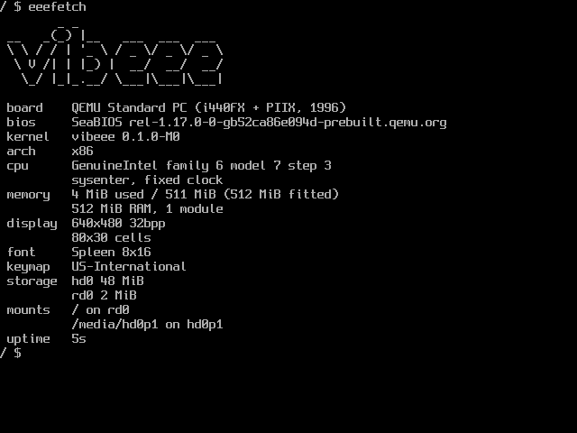

# vibeee

A from-scratch graphical operating system in Zig, targeting the **ASUS Eee PC 701 4G**,
a 2007 netbook: 630 MHz Celeron M, 512 MB RAM, 4 GB PATA SSD, 800×480 panel, no serial port.



Own bootloader, own kernel, own userspace. No Linux, no BSD, no libc. Builds to a raw
`dd`-able SD-card image with `zig`, `nasm` and `make`, no cross-GCC, no root, no loopback
mounts.

> ### ⚠️ This is vibecoded
>
> Hence the name. Almost all of the code, and all of the design documents, were written by
> Claude under my direction: I set the goals, made the architectural calls, reviewed the
> output and drove the debugging, but I did not type most of this.
>
> Treat it accordingly. It boots, it self-tests, and the bugs found so far were found by
> running it rather than by reading it. Nobody has audited it. It is a toy OS for a
> nineteen-year-old netbook, and that is the standard it is built to, not production, not
> security-reviewed, not something to trust with anything you care about.

```bash
make            # build/vibeee.img
make qemu       # boot it (the dev loop)
make vnc        # same, over VNC on :5901
make test       # host-side unit tests + QR differential verification
```

## What works today

**Boot**: two-stage bootloader. A 440-byte MBR loading a real-mode stage2 that reads the
kernel over INT 13h EDD through unreal mode, captures the E820 map, finds the ACPI RSDP,
optionally sets a VBE mode, and loads the root filesystem into RAM. The kernel then goes
higher-half at `0xC0100000` with all physical memory linearly mapped through 4 MiB pages.

**Memory**: Bitmap physical allocator over the real E820 map. Slab allocator exposed as a
`std.mem.Allocator`, so kernel code reads like ordinary Zig. Per-process page directories.

**Scheduling**: Preemptive O(1) scheduler: two run-queue arrays, a `u32` bitmap and one
`@ctz` to pick the next thread, so scheduling costs the same at three threads or three
hundred. Sleeping, yielding, per-thread FPU/SSE state, and a thread registry that includes
uncollected corpses.

**Processes**: Ring 3 with per-process address spaces, an ELF loader, synchronous and
detached `spawn`, `wait`, parent tracking, and orphan re-parenting onto PID 1. No `fork`
, deliberately (see the design doc).

**IPC**: Synchronous channels with a 64-byte inline payload, counting events with
`wait_many` as the only blocking primitive, and a `/svc` name registry. Blocking is real:
a waiting thread is off the run queues, not polling. Messages carry up to four handles,
translated across the boundary so the receiver gets its own numbers for the same objects,
and shared-memory segments can be mapped into several processes at once. `ringtest` proves
the whole chain between two processes: register, connect, hand over a segment, map it,
and move bytes through an SPSC ring.

**Storage**: ATA PIO, MBR partition parsing, a write-through block cache, and FAT12/16/32
with VFAT long names, behind a mount table that resolves paths by longest matching prefix.
Reading and writing both work: files can be created, appended to, truncated and removed,
and the shell has `>` and `>>`. Creating a file uses a short 8.3 name; long names are read
but not yet written.

**Console**: VGA text or a 32bpp linear framebuffer with the Spleen bitmap font, chosen at
boot from what the firmware provided.

**GUI**: `eeewm` is a tiling window manager with four tags, tall, wide and monocle layouts,
floating windows above the tiles, hairline borders and a status bar. `libeui` is the shared
control library: buttons, checkboxes, labels and progress bars, drawn flat from a swappable
theme, with keyboard focus and Tab order. Painting is damage-driven, so an idle desktop
writes no pixels. Text uses a proportional bitmap face rather than the terminal font.

**Input**, i8042 keyboard, scancode set 1, with keymaps compiled from one file per layout:
US-International and Belgian AZERTY, dead-key composition, `Super+Space` to switch.

**Time**: Monotonic clock from the PIT (ACPI PM timer supported, with wrap accumulation),
and a wall clock seeded once from the CMOS RTC. File timestamps and `date` are real.

**Devices**: PCI enumeration, SMBIOS/DMI decoding, and confidence-ranked driver probing:
an exact vendor:device match beats a class-level fallback, so one image boots the target
machine and hardware it has never seen.

**Shutdown**: Handles flushed, volumes unmounted, then ACPI power off via the FADT and a
`_S5_` pattern match.

**Diagnostics**: A panic screen that encodes the register dump and backtrace as a QR code,
drawn as raw pixel rectangles so it does not depend on a font having block glyphs. The
encoder is differentially tested against `libqrencode` across all eight masks.

**Userspace**, `init` (PID 1) supervises services declared in `/etc/services` with
dependency ordering and restart policy. `vsh` is the shell. A multicall binary provides
`ls cat rm hexdump grep free top disk svc date eeefetch dmidecode pointer ringtest`.

## Not yet

Shared memory across address spaces · pipes and redirection · filesystem writes · a text
editor · USB · touchpad · GMA900 native modeset · audio · networking · the GUI
(`eeewm` + `libeui`).

## Layout

```
boot/         stage1 (MBR) and stage2, NASM
src/arch/     ISA- and firmware-specific code, x86 only for now
src/kernel/   portable core: memory, scheduling, IPC, VFS, syscalls, panic
src/drv/      drivers, bound by runtime probe confidence
src/lib/      pure code compiled into BOTH kernel and userspace
src/user/     init, the shell, the system tools, the window manager and libeui
src/keymaps/  keyboard layouts, one file each
src/platform.zig  the only file that wires kernel, arch and drivers together
design/       the design documents
docs/         syscall reference and verified hardware research
```

## Design

[`design/00-vibeee.md`](design/00-vibeee.md) is the master design and is authoritative;
`01`–`11` cover subsystems and carry their own status headers.
[`docs/syscalls.md`](docs/syscalls.md) is generated from the syscall table, so it cannot
drift from the implementation.

Three rules are enforced by `tools/check-layering.zig` on every build, not just written
down:

1. `kernel/` never imports `arch/`, it reaches the architecture only through `kernel/hal.zig`.
2. `kernel/` never imports `drv/`, driver selection is a composition decision.
3. `lib/` imports nothing, it is compiled into both sides of the privilege boundary, so it
   holds pure computation only.

## Debugging without a serial port

The 701 has no serial port, which shapes everything: QEMU-first development, a stage2 log
ring replayed into the boot log, self-tests at boot that report `fail` rather than hanging,
and the QR panic screen, photograph the stop screen and the crash comes back as text.

Under emulation there *is* a serial port, and the console mirrors to it, so
`make shot OUT=x.png TYPE="..."` leaves a full text transcript beside the screenshot.
That is how a `fail` line scrolled off a 30-row display gets noticed.

```
VBE1|06|00000000|00000000|00103CFC|00162A78|00162F14|00101126,00107952
     │  │        │        │        │        │        └ backtrace
     │  │        │        │        │        └ ebp
     │  │        │        │        └ esp
     │  │        │        └ eip
     │  │        └ cr2 (page faults)
     │  └ error code
     └ exception vector
```

## Licence

Spleen (`third_party/spleen/`) is BSD 2-Clause, © Frederic Cambus.
Ark Pixel (`third_party/ark-pixel/`) is SIL Open Font License 1.1, © TakWolf.
